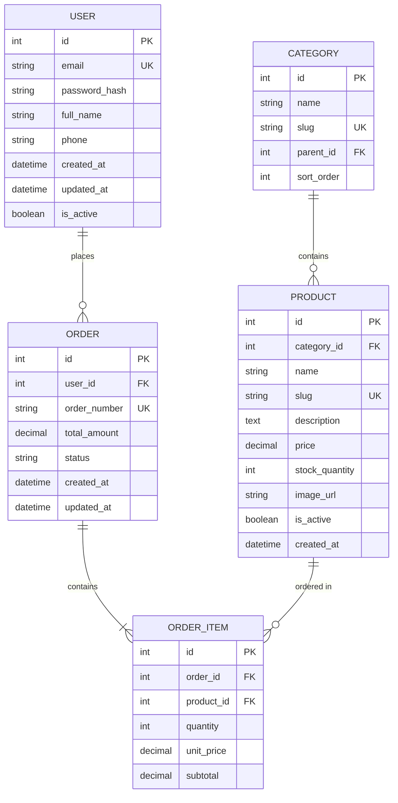

# 🗄️ DATA MODEL & DATABASE DESIGN

> **Dự án**: [Tên dự án]  
> **Version**: 1.0  
> **Ngày tạo**: [YYYY-MM-DD]  
> **Database**: [PostgreSQL / SQL Server / MySQL / SQLite / MongoDB]

---

## 1. 📊 Entity Relationship Diagram (ERD)



---

## 2. 📋 Table Definitions

### 2.1 Table: `users`

> **Mô tả**: Lưu thông tin người dùng hệ thống

| Column | Type | Constraints | Default | Description |
|--------|------|-------------|---------|-------------|
| `id` | INT | PK, AUTO_INCREMENT | - | Primary key |
| `email` | VARCHAR(255) | UNIQUE, NOT NULL | - | Email đăng nhập |
| `password_hash` | VARCHAR(255) | NOT NULL | - | Mật khẩu đã hash |
| `full_name` | NVARCHAR(100) | NOT NULL | - | Họ tên đầy đủ |
| `phone` | VARCHAR(20) | NULL | NULL | Số điện thoại |
| `avatar_url` | VARCHAR(500) | NULL | NULL | URL ảnh đại diện |
| `role` | ENUM | NOT NULL | 'user' | 'admin', 'user', 'moderator' |
| `is_active` | BOOLEAN | NOT NULL | TRUE | Trạng thái tài khoản |
| `email_verified_at` | DATETIME | NULL | NULL | Thời điểm xác thực email |
| `last_login_at` | DATETIME | NULL | NULL | Đăng nhập gần nhất |
| `created_at` | DATETIME | NOT NULL | CURRENT_TIMESTAMP | Ngày tạo |
| `updated_at` | DATETIME | NOT NULL | CURRENT_TIMESTAMP | Ngày cập nhật |

**Indexes**:
| Name | Columns | Type | Purpose |
|------|---------|------|---------|
| `idx_users_email` | email | UNIQUE | Tìm kiếm theo email |
| `idx_users_role` | role | INDEX | Filter theo role |
| `idx_users_created` | created_at | INDEX | Sắp xếp theo ngày tạo |

**Sample Data**:
```sql
INSERT INTO users (email, password_hash, full_name, role) VALUES
('admin@example.com', '$2a$10$...', 'Admin User', 'admin'),
('user1@example.com', '$2a$10$...', 'Nguyen Van A', 'user');
```

---

### 2.2 Table: `categories`

> **Mô tả**: Danh mục sản phẩm (hỗ trợ nested categories)

| Column | Type | Constraints | Default | Description |
|--------|------|-------------|---------|-------------|
| `id` | INT | PK, AUTO_INCREMENT | - | Primary key |
| `name` | NVARCHAR(100) | NOT NULL | - | Tên danh mục |
| `slug` | VARCHAR(100) | UNIQUE, NOT NULL | - | URL-friendly name |
| `description` | NTEXT | NULL | NULL | Mô tả |
| `parent_id` | INT | FK → categories.id, NULL | NULL | Danh mục cha |
| `icon` | VARCHAR(50) | NULL | NULL | Icon class/name |
| `image_url` | VARCHAR(500) | NULL | NULL | Ảnh danh mục |
| `sort_order` | INT | NOT NULL | 0 | Thứ tự hiển thị |
| `is_active` | BOOLEAN | NOT NULL | TRUE | Trạng thái |
| `created_at` | DATETIME | NOT NULL | CURRENT_TIMESTAMP | Ngày tạo |

**Indexes**:
| Name | Columns | Type | Purpose |
|------|---------|------|---------|
| `idx_categories_slug` | slug | UNIQUE | Lookup by slug |
| `idx_categories_parent` | parent_id | INDEX | Tree traversal |

**Hierarchy Example**:
```
Electronics (parent_id: NULL)
├── Phones (parent_id: 1)
│   ├── iPhone (parent_id: 2)
│   └── Samsung (parent_id: 2)
└── Laptops (parent_id: 1)
    ├── Gaming (parent_id: 3)
    └── Business (parent_id: 3)
```

---

### 2.3 Table: `products`

> **Mô tả**: Thông tin sản phẩm

| Column | Type | Constraints | Default | Description |
|--------|------|-------------|---------|-------------|
| `id` | INT | PK, AUTO_INCREMENT | - | Primary key |
| `category_id` | INT | FK → categories.id | - | Danh mục |
| `sku` | VARCHAR(50) | UNIQUE, NOT NULL | - | Mã sản phẩm |
| `name` | NVARCHAR(255) | NOT NULL | - | Tên sản phẩm |
| `slug` | VARCHAR(255) | UNIQUE, NOT NULL | - | URL-friendly name |
| `description` | NTEXT | NULL | NULL | Mô tả ngắn |
| `content` | NTEXT | NULL | NULL | Nội dung chi tiết (HTML) |
| `price` | DECIMAL(18,2) | NOT NULL | - | Giá bán |
| `compare_price` | DECIMAL(18,2) | NULL | NULL | Giá so sánh (gạch) |
| `cost_price` | DECIMAL(18,2) | NULL | NULL | Giá vốn |
| `stock_quantity` | INT | NOT NULL | 0 | Số lượng tồn |
| `low_stock_threshold` | INT | NOT NULL | 10 | Ngưỡng cảnh báo hết hàng |
| `weight` | DECIMAL(10,2) | NULL | NULL | Cân nặng (kg) |
| `image_url` | VARCHAR(500) | NULL | NULL | Ảnh chính |
| `images` | JSON | NULL | NULL | Danh sách ảnh phụ |
| `is_featured` | BOOLEAN | NOT NULL | FALSE | Sản phẩm nổi bật |
| `is_active` | BOOLEAN | NOT NULL | TRUE | Trạng thái |
| `meta_title` | NVARCHAR(255) | NULL | NULL | SEO title |
| `meta_description` | NVARCHAR(500) | NULL | NULL | SEO description |
| `created_at` | DATETIME | NOT NULL | CURRENT_TIMESTAMP | Ngày tạo |
| `updated_at` | DATETIME | NOT NULL | CURRENT_TIMESTAMP | Ngày cập nhật |

**Indexes**:
| Name | Columns | Type | Purpose |
|------|---------|------|---------|
| `idx_products_slug` | slug | UNIQUE | URL lookup |
| `idx_products_sku` | sku | UNIQUE | SKU lookup |
| `idx_products_category` | category_id | INDEX | Filter by category |
| `idx_products_price` | price | INDEX | Sort/filter by price |
| `idx_products_featured` | is_featured, is_active | INDEX | Homepage query |

---

### 2.4 Table: `orders`

> **Mô tả**: Đơn hàng

| Column | Type | Constraints | Default | Description |
|--------|------|-------------|---------|-------------|
| `id` | INT | PK, AUTO_INCREMENT | - | Primary key |
| `user_id` | INT | FK → users.id, NULL | NULL | Khách hàng (NULL = guest) |
| `order_number` | VARCHAR(20) | UNIQUE, NOT NULL | - | Mã đơn hàng (VD: ORD-20260109-001) |
| `status` | ENUM | NOT NULL | 'pending' | Trạng thái đơn |
| `subtotal` | DECIMAL(18,2) | NOT NULL | - | Tổng tiền hàng |
| `discount_amount` | DECIMAL(18,2) | NOT NULL | 0 | Giảm giá |
| `shipping_fee` | DECIMAL(18,2) | NOT NULL | 0 | Phí vận chuyển |
| `tax_amount` | DECIMAL(18,2) | NOT NULL | 0 | Thuế |
| `total_amount` | DECIMAL(18,2) | NOT NULL | - | Tổng thanh toán |
| `currency` | CHAR(3) | NOT NULL | 'VND' | Đơn vị tiền tệ |
| `customer_name` | NVARCHAR(100) | NOT NULL | - | Tên người nhận |
| `customer_email` | VARCHAR(255) | NOT NULL | - | Email |
| `customer_phone` | VARCHAR(20) | NOT NULL | - | SĐT |
| `shipping_address` | NVARCHAR(500) | NOT NULL | - | Địa chỉ giao |
| `shipping_city` | NVARCHAR(100) | NULL | NULL | Thành phố |
| `shipping_district` | NVARCHAR(100) | NULL | NULL | Quận/Huyện |
| `shipping_ward` | NVARCHAR(100) | NULL | NULL | Phường/Xã |
| `note` | NTEXT | NULL | NULL | Ghi chú |
| `payment_method` | ENUM | NOT NULL | - | Phương thức thanh toán |
| `payment_status` | ENUM | NOT NULL | 'pending' | Trạng thái thanh toán |
| `paid_at` | DATETIME | NULL | NULL | Thời điểm thanh toán |
| `shipped_at` | DATETIME | NULL | NULL | Thời điểm giao hàng |
| `delivered_at` | DATETIME | NULL | NULL | Thời điểm nhận hàng |
| `cancelled_at` | DATETIME | NULL | NULL | Thời điểm hủy |
| `cancel_reason` | NVARCHAR(500) | NULL | NULL | Lý do hủy |
| `created_at` | DATETIME | NOT NULL | CURRENT_TIMESTAMP | Ngày tạo |
| `updated_at` | DATETIME | NOT NULL | CURRENT_TIMESTAMP | Ngày cập nhật |

**Enums**:
```
status: 'pending', 'confirmed', 'processing', 'shipping', 'delivered', 'cancelled', 'refunded'
payment_method: 'cod', 'bank_transfer', 'momo', 'vnpay', 'zalopay'
payment_status: 'pending', 'paid', 'failed', 'refunded'
```

---

### 2.5 Table: `order_items`

> **Mô tả**: Chi tiết sản phẩm trong đơn hàng

| Column | Type | Constraints | Default | Description |
|--------|------|-------------|---------|-------------|
| `id` | INT | PK, AUTO_INCREMENT | - | Primary key |
| `order_id` | INT | FK → orders.id | - | Đơn hàng |
| `product_id` | INT | FK → products.id | - | Sản phẩm |
| `product_name` | NVARCHAR(255) | NOT NULL | - | Tên SP (snapshot) |
| `product_sku` | VARCHAR(50) | NOT NULL | - | SKU (snapshot) |
| `product_image` | VARCHAR(500) | NULL | NULL | Ảnh (snapshot) |
| `quantity` | INT | NOT NULL | - | Số lượng |
| `unit_price` | DECIMAL(18,2) | NOT NULL | - | Đơn giá |
| `subtotal` | DECIMAL(18,2) | NOT NULL | - | Thành tiền |

> ⚠️ **Note**: Lưu snapshot thông tin sản phẩm tại thời điểm đặt hàng để không bị ảnh hưởng khi sản phẩm thay đổi.

---

## 3. 🔗 Relationships Summary

```
┌─────────────────────────────────────────────────────────────┐
│                    RELATIONSHIP MAP                          │
├─────────────────────────────────────────────────────────────┤
│                                                              │
│   users ─────────────────┐                                   │
│     │                    │                                   │
│     │ 1:N                │ 1:N                               │
│     ▼                    ▼                                   │
│   orders              reviews                                │
│     │                                                        │
│     │ 1:N                                                    │
│     ▼                                                        │
│   order_items ◄────────── products                           │
│                    N:1       │                               │
│                              │ N:1                           │
│                              ▼                               │
│                          categories                          │
│                              │                               │
│                              │ self-reference (parent)       │
│                              ▼                               │
│                          categories                          │
│                                                              │
└─────────────────────────────────────────────────────────────┘
```

---

## 4. 📐 Database Conventions

### Naming Conventions
| Object | Convention | Example |
|--------|------------|---------|
| Tables | snake_case, plural | `order_items` |
| Columns | snake_case | `created_at` |
| Primary Keys | `id` | `id` |
| Foreign Keys | `{table}_id` | `user_id` |
| Indexes | `idx_{table}_{columns}` | `idx_products_category` |
| Unique Constraints | `uk_{table}_{column}` | `uk_users_email` |

### Common Columns
Mọi table nên có:
```sql
created_at DATETIME NOT NULL DEFAULT CURRENT_TIMESTAMP,
updated_at DATETIME NOT NULL DEFAULT CURRENT_TIMESTAMP ON UPDATE CURRENT_TIMESTAMP
```

### Soft Delete (Optional)
```sql
deleted_at DATETIME NULL DEFAULT NULL
-- Khi delete: UPDATE ... SET deleted_at = NOW()
-- Khi query: WHERE deleted_at IS NULL
```

---

## 5. 🔄 Migration Plan

### Initial Schema
```sql
-- migrations/001_initial_schema.sql
CREATE TABLE users (...);
CREATE TABLE categories (...);
CREATE TABLE products (...);
CREATE TABLE orders (...);
CREATE TABLE order_items (...);
```

### Seed Data
```sql
-- migrations/002_seed_data.sql
INSERT INTO categories (...) VALUES (...);
INSERT INTO users (...) VALUES (...);
```

---

## 6. 📊 Query Examples

### Get products by category with pagination
```sql
SELECT p.*, c.name as category_name
FROM products p
JOIN categories c ON p.category_id = c.id
WHERE c.slug = @category_slug
  AND p.is_active = 1
ORDER BY p.created_at DESC
LIMIT @page_size OFFSET @offset;
```

### Get order with items
```sql
SELECT o.*, oi.*, p.image_url
FROM orders o
JOIN order_items oi ON o.id = oi.order_id
JOIN products p ON oi.product_id = p.id
WHERE o.id = @order_id;
```

---

## 7. 🔗 Related Documents

- [PRD](prd.md)
- [API Specs](api-specs.md)
- [UI Specs](ui-specs.md)

---

> 📝 **Note**: Cập nhật document này mỗi khi có thay đổi schema database.
