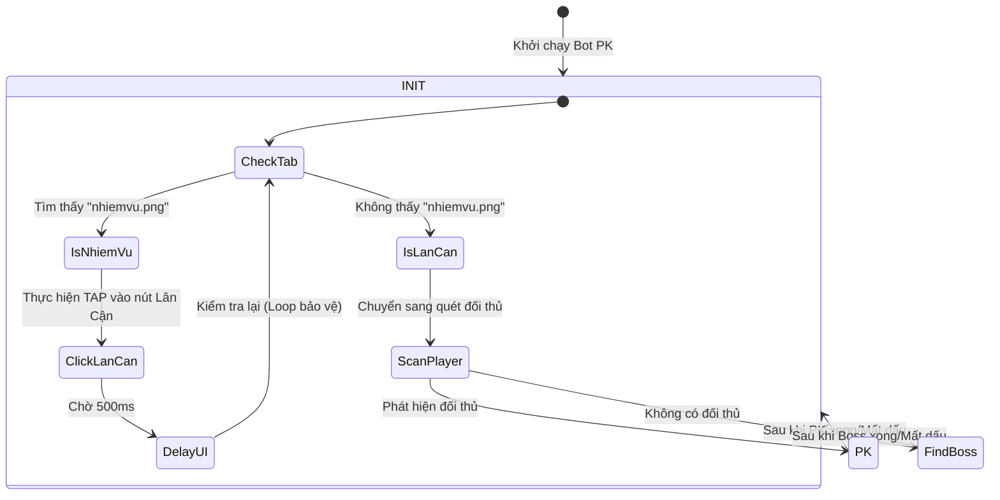

# 🧠 Logic Flow - Task T003 (PK Auto-Switch Tab)

## 📊 State Machine Diagram (Mermaid)

## 🎯 Phân tích của Tech Lead
- **Logic bảo vệ**: Trong cụm `INIT`, chúng ta sử dụng một vòng lặp kiểm tra lại sau khi Click (Loop bảo vệ) để đảm bảo nếu UI lag, bot sẽ không tiếp tục logic PK khi đang ở tab sai.
- **Trigger**: Chỉ Click khi thực sự thấy `nhiemvu.png`. Nếu không thấy, mặc định coi như đang ở tab PK hoặc UI khác không gây hại.

## 🧪 Phân tích của Tester Lead
- **Test Case TC-NAV-001**: Bot đang ở tab Nhiệm vụ -> Phải click trúng nút Lân Cận.
- **Test Case TC-NAV-002**: Bot đang ở tab Lân Cận -> Không được click lại (tránh nháy màn hình).
- **Test Case TC-NAV-003**: LDPlayer bị lag, click lần 1 chưa chuyển tab -> Phải click lại lần 2.
