# 🧠 Logic Flow - Task T003 (PK Auto-Switch Tab)

## 📊 State Machine Diagram (Mermaid)

```mermaid
stateDiagram-v2
    [*] --> INIT: Khởi chạy Bot PK
    
    state INIT {
        [*] --> CheckTab
        CheckTab --> IsNhiemVu: Tìm thấy "nhiemvu.png"
        CheckTab --> IsLanCan: Không thấy "nhiemvu.png"
        
        IsNhiemVu --> ClickLanCan: Thực hiện TAP vào nút Lân Cận
        ClickLanCan --> DelayUI: Chờ 500ms
        DelayUI --> CheckTab: Kiểm tra lại (Loop bảo vệ)
        
        IsLanCan --> ScanPlayer: Chuyển sang quét đối thủ
    }
    
    ScanPlayer --> PK: Phát hiện đối thủ
    ScanPlayer --> FindBoss: Không có đối thủ
    
    PK --> INIT: Sau khi PK xong/Mất dấu
    FindBoss --> INIT: Sau khi Boss xong/Mất dấu
```

## 🎯 Phân tích của Tech Lead
- **Logic bảo vệ**: Trong cụm `INIT`, chúng ta sử dụng một vòng lặp kiểm tra lại sau khi Click (Loop bảo vệ) để đảm bảo nếu UI lag, bot sẽ không tiếp tục logic PK khi đang ở tab sai.
- **Trigger**: Chỉ Click khi thực sự thấy `nhiemvu.png`. Nếu không thấy, mặc định coi như đang ở tab PK hoặc UI khác không gây hại.

## 🧪 Phân tích của Tester Lead
- **Test Case TC-NAV-001**: Bot đang ở tab Nhiệm vụ -> Phải click trúng nút Lân Cận.
- **Test Case TC-NAV-002**: Bot đang ở tab Lân Cận -> Không được click lại (tránh nháy màn hình).
- **Test Case TC-NAV-003**: LDPlayer bị lag, click lần 1 chưa chuyển tab -> Phải click lại lần 2.
