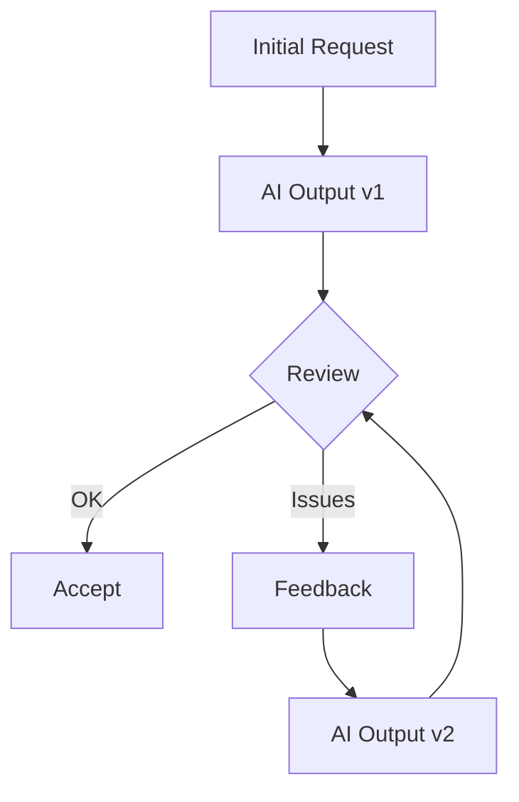

# 🧠 Thinking - Framework Tư Duy với AI Agent

> 💡 **Cách tiếp cận và tư duy hiệu quả khi làm việc với AntiGravity AI**

---

## 📋 Tổng Quan

AI Agent là công cụ mạnh mẽ nhưng cần được hướng dẫn đúng cách. Document này giúp bạn:
- Đặt yêu cầu rõ ràng và hiệu quả
- Review và đánh giá output từ AI
- Xử lý khi AI hiểu sai hoặc đi chệch hướng

---

## 🎯 Nguyên Tắc Cốt Lõi

### 1. AI Là Người Đồng Nghiệp, Không Phải Oracle

```
✅ Coi AI như senior developer cần context
❌ Mong đợi AI đoán đúng mọi thứ

✅ Cung cấp đủ thông tin cần thiết
❌ Chỉ đưa yêu cầu 1 câu mơ hồ

✅ Review và validate output
❌ Accept mọi thứ AI đề xuất mù quáng
```

### 2. Chất Lượng Input = Chất Lượng Output

| Input | Output |
|-------|--------|
| Mơ hồ, thiếu context | Code thừa/thiếu, cần sửa nhiều |
| Rõ ràng, có constraints | Code đúng yêu cầu, ít refactor |
| Chi tiết + examples | Code production-ready |

---

## 📝 Cấu Trúc Prompt Hiệu Quả

### Template Cơ Bản

```markdown
## Context
[Mô tả ngắn về dự án/tính năng hiện tại]

## Yêu cầu
[Mô tả cụ thể những gì cần làm]

## Constraints
- [Giới hạn về tech stack]
- [Giới hạn về performance]
- [Giới hạn về thời gian/scope]

## Expected Output
[Mô tả kết quả mong đợi]
```

### Ví Dụ Tốt vs Xấu

| ❌ Prompt Kém | ✅ Prompt Tốt |
|--------------|--------------|
| "Làm cái login" | "Implement login page với email/password, validate form, gọi API /auth/login, redirect tới /dashboard sau khi thành công" |
| "Fix cái bug" | "User báo lỗi: click button Submit không có response. Tôi đã check console thấy error 401. Hãy debug và fix" |
| "Tối ưu code" | "Refactor UserService.GetAll() - hiện đang load 10k records, cần pagination với 50 items/page" |

---

## 🔍 Review Output Từ AI

### Checklist Review

```
[ ] Code có compile/build được không?
[ ] Logic có đúng với yêu cầu không?
[ ] Edge cases có được handle không?
[ ] Error handling có đầy đủ không?
[ ] Code style có consistent không?
[ ] Có security issues không?
[ ] Performance có acceptable không?
```

### Red Flags Cần Chú Ý

| 🚩 Red Flag | Hành động |
|-------------|-----------|
| AI thêm features không yêu cầu | Yêu cầu remove, stick to requirements |
| Code quá phức tạp cho problem đơn giản | Yêu cầu simplify |
| Hardcoded values | Yêu cầu extract thành config |
| Không có error handling | Yêu cầu thêm try-catch/validation |
| Copy-paste code | Yêu cầu refactor thành function |

---

## 🔄 Xử Lý Khi AI Đi Chệch Hướng

### Scenario 1: AI Hiểu Sai Yêu Cầu

```markdown
Tôi thấy bạn đang [mô tả việc AI đang làm].

Đó không phải điều tôi cần. Yêu cầu của tôi là:
- [Clarify lại yêu cầu cụ thể]

Hãy dừng lại và bắt đầu lại theo hướng này.
```

### Scenario 2: AI Đề Xuất Giải Pháp Quá Phức Tạp

```markdown
Giải pháp bạn đề xuất quá phức tạp cho use case của tôi.

Constraints:
- Chỉ cần MVP, không cần scale
- Timeline: 2 ngày
- Chỉ có 1 developer

Hãy đề xuất giải pháp đơn giản hơn.
```

### Scenario 3: AI Bị Stuck/Loop

```markdown
Dừng lại. Hãy:
1. Tóm tắt lại những gì đã làm được
2. List các issues đang gặp
3. Đề xuất 2-3 hướng giải quyết

Sau đó chờ tôi chọn hướng đi tiếp.
```

---

## 🔁 Iteration Pattern

### Refinement Loop



### Feedback Hiệu Quả

| ❌ Feedback Kém | ✅ Feedback Tốt |
|----------------|----------------|
| "Sai rồi" | "Function X return null khi input empty, cần return empty array" |
| "Chưa đẹp" | "Thêm margin 16px giữa các card, đổi màu button thành #3B82F6" |
| "Chậm quá" | "Query này mất 5s với 1000 records, cần thêm index trên column Y" |

---

## 💡 Tips & Tricks

### Khi Bắt Đầu Dự Án Mới

1. Cung cấp `about.md` và `system.md` để AI hiểu context
2. Share relevant Knowledge Items nếu có
3. Describe tech stack và constraints rõ ràng

### Khi Debug

1. Cung cấp error message đầy đủ
2. Describe steps to reproduce
3. Share relevant logs/screenshots

### Khi Refactor

1. Explain "why" cần refactor, không chỉ "what"
2. Define scope rõ ràng (file nào, function nào)
3. Specify breaking changes acceptable hay không

---

## 🔗 Tài Liệu Liên Quan

- 📄 [workflow.md](workflow.md) - Quy trình làm việc
- 📄 [quality.md](quality.md) - Checklist chất lượng
- 📄 [context.md](context.md) - Template context dự án

---

> 🌟 *"Garbage in, garbage out"* — Input tốt tạo ra output tốt
